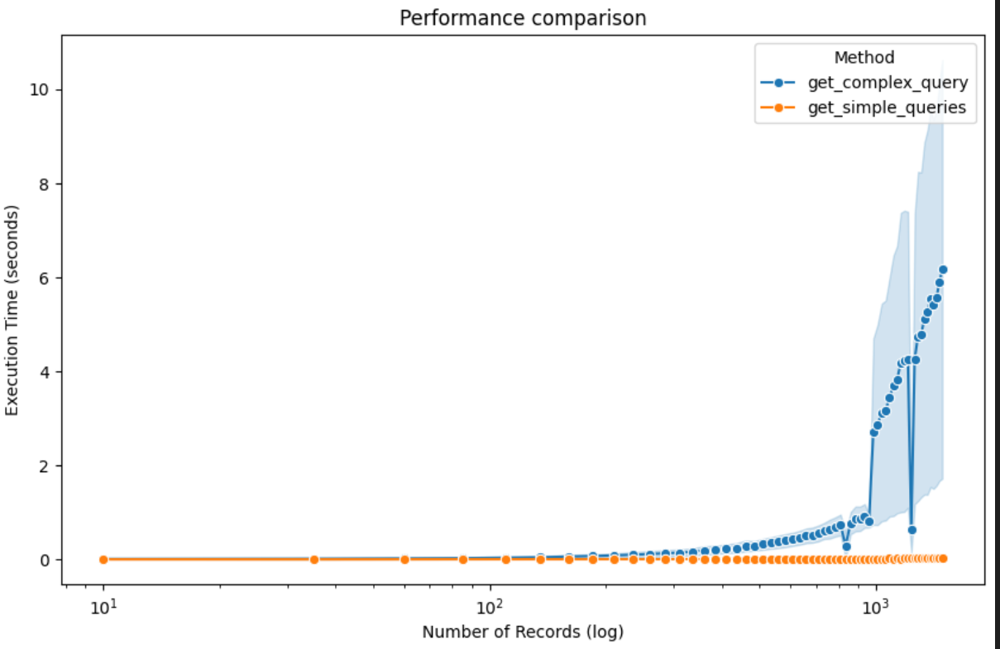
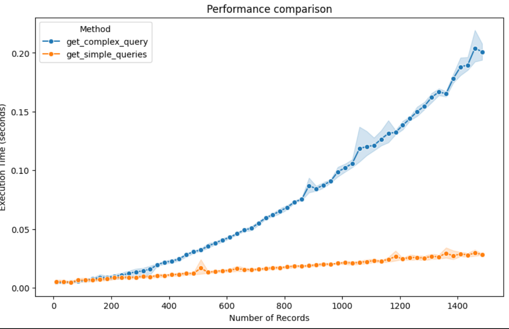
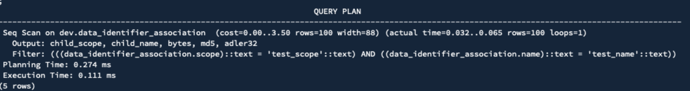
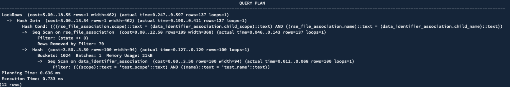
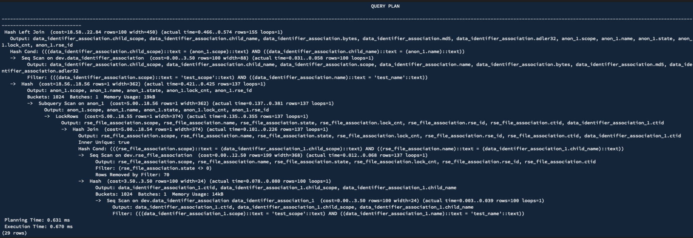

# Miscellaneous db performance testing experiments

Currently, and for the immediate future, solely focused on experiments related to Rucio (https://github.com/rucio/rucio).

   

## Performance of retrieving different 'Result'-esque types - PSQL/SQLAlchemy

  
  

   

## Complex query vs. two simpler queries - PSQL/SQLALCHEMY

  
  

### (EXPLAIN ANALYZE VERBOSE) Simple queries 

### (EXPLAIN ANALYZE VERBOSE) Complex query

