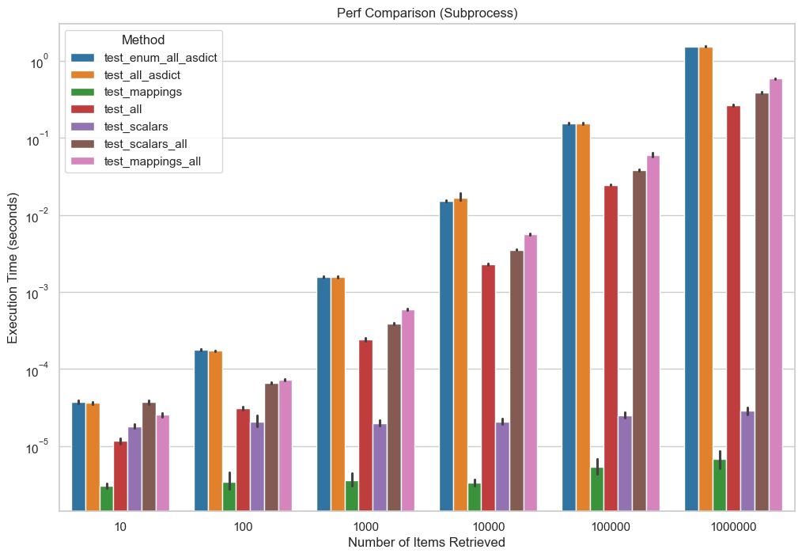

# Miscellaneous db performance testing experiments

Currently, and for the immediate future, solely focused on experiments related to Rucio (https://github.com/rucio/rucio).

## Experiment 1 - Performance of retrieving different 'Result'-esque types from SQLAlchemy

